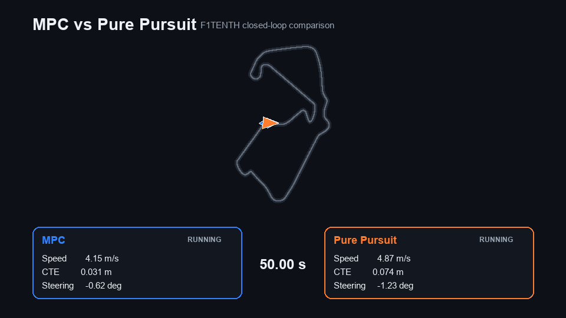
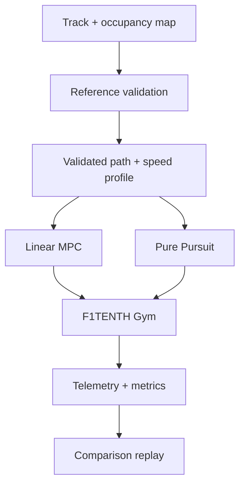

# F1TENTH MPC Controller


A constrained linear time-varying MPC controller for F1TENTH path tracking, implemented with a persistent QP solver and benchmarked against a tuned Pure Pursuit baseline across five circuits under matched experimental conditions.



## Results at a Glance

| | MPC | Tuned Pure Pursuit |
|---|---:|---:|
| Collision-free laps (5/5 tracks) | Yes | Yes |
| Avg. lap time | Competitive, ~0.5–1% slower | Slightly faster |
| Cross-track RMSE | Higher | **Lower** |
| Heading RMSE | **Lower** | Higher |
| Compute cost per update | Higher | Much lower |

MPC wins on heading accuracy; Pure Pursuit wins on lap time and cross-track error on these validated references. The project's core finding is that added model and optimization complexity doesn't automatically beat a well-tuned simple controller — full breakdown in [Results](#results).

## Engineering Question

**What does a constrained MPC controller actually buy you over a much simpler geometric tracker, when both run on the same vehicle, path, and simulator?** Rather than assuming MPC wins because it's more sophisticated, the project builds a controlled, apples-to-apples comparison and reports the result.

This meant building the full controls-development chain:
kinematic vehicle model → analytical Jacobian linearization → constrained QP formulation → independent solver validation → nonlinear closed-loop integration → systematic cost-weight tuning → a persistent native-OSQP rewrite after the CVXPY prototype couldn't hold 10 Hz → occupancy-map path safety validation → five-track evaluation → synchronized comparison replays.

## System Overview



Both controllers operate on the same validated reference, vehicle configuration, simulation environment, and evaluation pipeline, keeping the comparison focused on path-tracking behavior.

## Vehicle Model

Prediction uses a kinematic bicycle model with state $\mathbf{z} = [x, y, v, \psi]^T$ and input $\mathbf{u} = [a, \delta]^T$:

$$
\dot{x}=v\cos\psi, \quad \dot{y}=v\sin\psi, \quad \dot{v}=a, \quad \dot{\psi}=\frac{v}{L}\tan\delta
$$

For MPC, this nonlinear model is linearized analytically about a nominal state-input pair at every prediction step and discretized into an affine time-varying form:

$$
\mathbf{z}_{k+1}=A_k\mathbf{z}_k+B_k\mathbf{u}_k+C_k
$$

The affine term $C_k$ keeps the local approximation consistent with the nonlinear dynamics at the operating point. Jacobians and the linearization consistency check are derived in [`docs/C2_KBM_Linearization.pdf`](docs/C2_KBM_Linearization.pdf). This is **linear time-varying MPC**: the nonlinear vehicle equations shape the local model each step, but they never enter the optimization as nonlinear constraints — that keeps the online problem a QP.

## MPC Formulation

At each 100 ms control update, a finite-horizon QP is solved over a rebuilt reference:

$$
\min_{\mathbf{z},\mathbf{u}}
\sum_{k=0}^{N-1}
\left(
\|\mathbf{z}_k-\mathbf{z}^{ref}_k\|_Q^2
+\|\mathbf{u}_k\|_R^2
+\|\Delta\mathbf{u}_k\|_{R_\Delta}^2
\right)
+\|\mathbf{z}_N-\mathbf{z}^{ref}_N\|_{Q_f}^2
$$

subject to the affine dynamics and vehicle input limits, trading off state tracking, terminal accuracy, control effort, and steering/acceleration smoothness. Only the first optimized input is applied (receding horizon); the state is re-observed, the model re-linearized, and the QP re-solved every cycle.

| Parameter | Value |
|---|---:|
| Prediction horizon | 8 steps |
| Control interval | 0.10 s |
| Physics interval | 0.01 s |
| Wheelbase | 0.3302 m |
| Max reference speed | 8.0 m/s |
| $Q$ / $Q_f$ | $(4,4,1,4)$ / $(8,8,2,8)$ |
| $R$ / $R_\Delta$ | $(0.1,0.2)$ / $(0.1,1.0)$ |

Final weights came from an eight-case sweep exposing the trade-off between cross-track error, heading error, steering variation, and compute load.

**Solver Path:** CVXPY/OSQP was used for formulation and validation, but its per-update overhead made consistent 10 Hz timing impractical. The final controller uses a persistent native OSQP path that reuses the QP structure across updates and only refreshes the time-varying data. CVXPY remains in the repo as the validated reference implementation; native OSQP is what runs in all final and multi-track experiments.

## Pure Pursuit Baseline

A tuned geometric lookahead controller, evaluated under identical simulation, path, and longitudinal conditions as MPC.

## Experimental Method

The comparison holds every major condition fixed (vehicle geometry, RK4 integrator at 10 ms, 100 ms controller period, initial pose, reference path, speed profile, lap/collision rules) and varies only the lateral-control method. Metrics logged: lap completion, collisions, lap time, cross-track RMSE, heading RMSE, steering total variation, controller update time, and deadline misses; multi-track runs add progress, map clearance, and termination state.

**Reference-Path Validation:** Supplied racelines aren't trusted by default. Each reference is checked against the occupancy map via distance transform and must maintain ≥0.20 m clearance; references that fail are replaced with the corresponding centerline. This mattered in practice — the supplied racelines for the evaluated circuits failed the clearance check, while the centerlines passed, so all reported results are on validated, collision-feasible geometry.

## Results

### Single-Track Controlled Comparison

| Metric | MPC | Tuned Pure Pursuit |
|---|---:|---:|
| Collision-free lap | Yes | Yes |
| Lap time | **23.610 s** | 24.070 s |
| Cross-track RMSE | 0.1439 m | **0.1241 m** |
| Heading RMSE | **4.732 deg** | 5.716 deg |
| Steering total variation | 6.0560 rad | **3.9778 rad** |

MPC was faster with lower heading error; Pure Pursuit had lower cross-track error and much smoother steering. MPC's per-update compute cost here is what motivated the native OSQP rewrite.

### Multi-Track Evaluation (5 Circuits: Silverstone, Spielberg, Monza, Nürburgring, Zandvoort)

| Track | MPC lap | PP lap | MPC CTE RMSE | PP CTE RMSE |
|---|---:|---:|---:|---:|
| Silverstone | 85.470 s | **84.740 s** | 0.0771 m | **0.0676 m** |
| Spielberg | 59.830 s | **59.150 s** | 0.0928 m | **0.0746 m** |
| Monza | 72.190 s | **71.630 s** | 0.0788 m | **0.0679 m** |
| Nürburgring | 86.110 s | **85.640 s** | 0.0795 m | **0.0665 m** |
| Zandvoort | 77.900 s | **77.880 s** | 0.0775 m | **0.0689 m** |

On longer, validated references, Pure Pursuit is slightly faster and consistently lower-CTE across all five tracks. **Added model and optimization complexity doesn't automatically produce a better tracking controller on every metric.** MPC's value is its predictive, constraint-aware formulation; whether that's worth the extra computation depends on the operating regime and what's being optimized for. Raw per-track telemetry is under `results/d3/`.

### Comparison Replays

Offline-generated from recorded multi-track telemetry (10 Hz experimental data interpolated to 60 FPS for viewing — these are replays, not higher-rate runs):

| Track | Replay |
|---|---|
| Silverstone | [▶ Watch replay](https://raw.githubusercontent.com/Andromeda-crypto/f1tenth-mpc-controller/refs/heads/main/results/d5/silverstone/silverstone_comparison.mp4) |
| Spielberg | [▶ Watch replay](https://raw.githubusercontent.com/Andromeda-crypto/f1tenth-mpc-controller/refs/heads/main/results/d5/spielberg/spielberg_comparison.mp4) |
| Monza | [▶ Watch replay](https://raw.githubusercontent.com/Andromeda-crypto/f1tenth-mpc-controller/refs/heads/main/results/d5/monza/monza_comparison.mp4) |
| Nürburgring | [▶ Watch replay](https://raw.githubusercontent.com/Andromeda-crypto/f1tenth-mpc-controller/refs/heads/main/results/d5/nuerburgring/nuerburgring_comparison.mp4) |
| Zandvoort | [▶ Watch replay](https://raw.githubusercontent.com/Andromeda-crypto/f1tenth-mpc-controller/refs/heads/main/results/d5/zandvoort/zandvoort_comparison.mp4) |

## Repository Structure

```text
f1tenth-mpc-controller/
├── f1tenth_mpc/        reusable dynamics, MPC, path, PID, and Pure Pursuit code
├── experiments/        validation, tuning, comparison, and replay scripts
├── tests/              linearization, QP, constraints, and solver checks
├── configs/            F1TENTH Gym configuration
├── data/
│   ├── maps/           occupancy maps and metadata
│   └── waypoints/      racelines, centerlines, and speed references
├── docs/               mathematical derivations and supporting notes
├── results/
│   ├── d1/             controlled controller comparison
│   ├── d3/             final multi-track telemetry
│   ├── d5/             synchronized comparison replays
│   └── track_validation/
└── requirements.txt
```

Experiment filenames retain development-stage identifiers (`c4`, `d1`, `d5`, etc.) marking validation milestones — they're not part of the public API. Reusable implementation lives under `f1tenth_mpc/`, kept separate from the experiment scripts.

## Setup

Validated on Python 3.8.10.

**Windows (PowerShell)**
```powershell
py -3.8 -m venv .gym_env
Set-ExecutionPolicy -Scope Process -ExecutionPolicy RemoteSigned
& .\.gym_env\Scripts\Activate.ps1
python -m pip install -r requirements.txt
```

**macOS / Linux**
```bash
python3.8 -m venv .gym_env
source .gym_env/bin/activate
python -m pip install -r requirements.txt
```

## Reproducing the Work

```bash
# QP and solver checks
python -m tests.test_mpc_qp

# Standalone nonlinear forward-simulation comparison
python -m experiments.c4_forward_sim

# Final controller comparison
python -m experiments.d1_gym_comparison --controller both --solver native

# Multi-track experiment (also: spielberg, monza, nuerburgring, zandvoort)
python -m experiments.d3_multitrack --track silverstone --controller both

# Generate a replay from frozen telemetry (no physics/optimization rerun)
python -m experiments.d5_replay --track silverstone --fps 60
```

## Known Constraints

- Prediction model is kinematic; no tire slip or load transfer.
- Simulation-only; no sensor, actuator, or embedded-compute effects from real hardware.
- Linear time-varying MPC, not nonlinear MPC.
- Scope is path tracking, not obstacle avoidance or planning.
- Timing figures are development-machine measurements, not embedded-hardware benchmarks.
- Five tracks is a broad but finite, deterministic evaluation set.

## Further Work

- Repeated trials to quantify timing and tracking variance.
- Evaluate the persistent solver on F1TENTH-class embedded compute.
- Dynamic bicycle model near the handling limits, with friction-aware constraints or nonlinear MPC where the kinematic approximation breaks down.
- Port the same experimental design to physical F1TENTH hardware.

## References

- [F1TENTH](https://f1tenth.org/) · [F1TENTH Gym](https://github.com/f1tenth/f1tenth_gym)
- R. C. Coulter, *Implementation of the Pure Pursuit Path Tracking Algorithm*, Carnegie Mellon University, 1992.

---
**Om Anand** · Computer Science & Mathematics, The Pennsylvania State University
